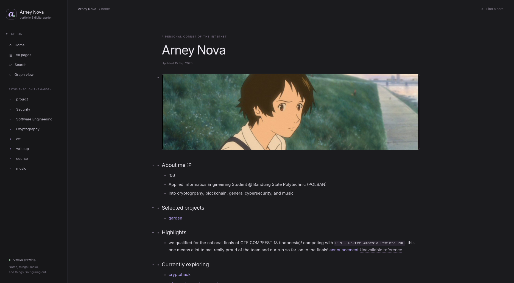
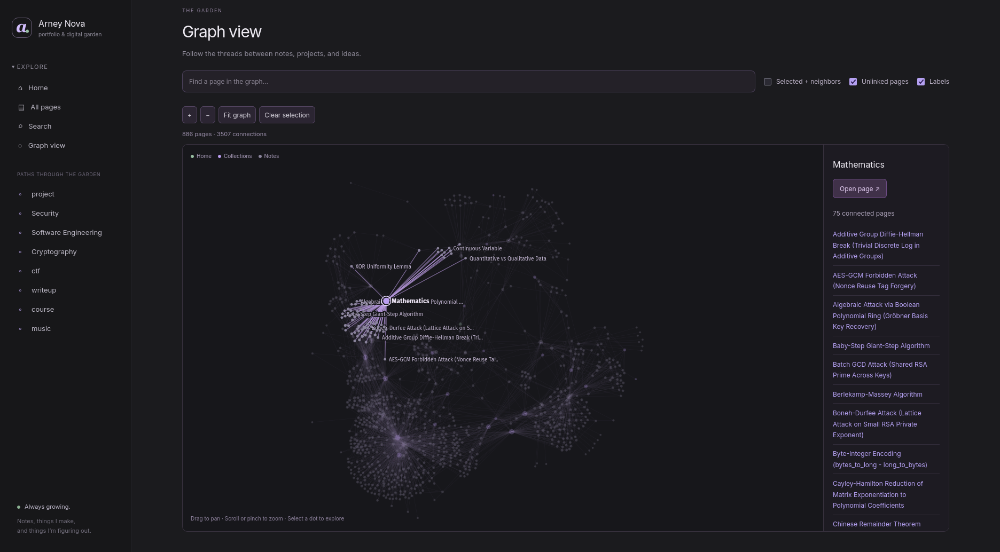

<p align="center"></p>

# garden

My portfolio and notes on security, software, music, and whatever else I get into.
Written in Logseq, published as a static website.

**[Visit the garden](https://arney-garden.pages.dev)** · **[Explore the graph](https://arney-garden.pages.dev/graph/)** · **[Exporter docs](vendor/logseq-static-garden/static-garden/README.md)**



## Why I built this

I love writing in Logseq: outlines, linked notes, and a graph I can get lost in.
Its public export brought the whole app along, though. Reading my homepage meant
waiting for a large JavaScript bundle and a browser database to start.

The separate [`logseq-static-garden`](https://github.com/Arney1/logseq-static-garden)
exporter does that work during the build. Every note has its own HTML page. The site keeps the sidebar and outlines, with a custom “a”
mark and a layout that works as both a portfolio and a garden.

## What's here

- **Notes you can read immediately.** Page content, properties, code highlighting,
  and equations arrive as HTML. Browsing and block collapsing work without JavaScript.
- **Connected writing.** Page links, block references, backlinks, tags, and nested
  pages carry over from the public export.
- **An interactive graph.** Pan, zoom, drag nodes, search for a page, or focus on
  its neighbors. On phones, larger touch targets and a selected-page preview make
  nodes easier to open. Layout is computed during the build; the viewer loads on `/graph/`.
- **Navigation within reach.** Phones get a bottom bar and an expandable Explore
  menu; desktop keeps the sidebar. Both work without JavaScript.
- **Search when you need it.** The full-text index loads on the first query.
- **CTF writeups alongside the notes.** Techniques, challenges, and walkthroughs
  live under `project/ctf/`, alongside the rest of the garden.
- **A small browser runtime.** Plain CSS, JavaScript, and Canvas. No React,
  database workers, or WASM in the published site.



## The size difference

| Uncompressed file | Logseq public export | Static build |
| --- | ---: | ---: |
| Homepage HTML | ~17.6 MB | ~11.7 KB |
| Main browser script | ~11 MB | ~3.7 KB |

Measured on an export with **886 pages, 12,762 blocks, and 1,377 equations**.
These are individual file sizes, not total transfer sizes or a load-time benchmark;
images, stylesheets, and the optional search and graph data are separate.
Each build writes the current counts and sizes to `dist-report.json`.

## Build

Python 3.10+ with venv support and Node.js are required. No npm install.

```sh
./build-static.sh
./install-hooks.sh
python3 -m http.server 8000 --directory dist
```

Preview at [localhost:8000](http://localhost:8000).

### Publishing

Export public pages from Logseq into this repository, stage the changes, commit,
and push. The pre-commit hook checks the staged export; Cloudflare Pages builds
and deploys `dist/`.

| Cloudflare Pages setting | Value |
| --- | --- |
| Framework preset | None |
| Build command | `./build-static.sh` |
| Build output directory | `dist` |

There is no manual `patch-index.py` step. The hook validates files without
rewriting or auto-staging them. Only `dist/` is the website; the repository root
contains the original export and build tools.

## Two projects, two jobs

This repository is **my personal website**. The reusable renderer lives in a
separate project, [**logseq-static-garden**](https://github.com/Arney1/logseq-static-garden),
with fictional sample content and its own tests. Please send renderer improvements
there. Personal notes and site-specific changes belong here.

| Path | What it contains |
| --- | --- |
| `index.html`, `assets/`, `static/` | Public Logseq export and its original runtime |
| `site.json` | My homepage, navigation, description, and canonical URL |
| `branding/` | My site logo, kept outside the raw export |
| `vendor/logseq-static-garden/` | Exact exporter snapshot used by builds |
| `exporter.lock.json` | Exporter commit and file checksums |
| `tools/`, `.githooks/` | Snapshot updates and staged-build validation |
| `dist/` | Generated website; ignored by Git |

A build uses the checked-in snapshot. It does not fetch an exporter branch or
require the separate checkout on your machine. The build and pre-commit hook both
check the snapshot against the lock file.

For renderer changes and deliberate upgrades, see [Updating the exporter](docs/exporter.md).
The [exporter guide](vendor/logseq-static-garden/static-garden/README.md) describes
rendering support, attachment handling, and limitations.

The deployed site uses a strict Content Security Policy and download-only handling
for non-media attachments. Content and attachments in this repository are public;
the exporter does not scan them for secrets.

## License

The static exporter and build tools are [MIT licensed](licenses/MIT.txt).
Logseq's bundled runtime retains AGPLv3 terms, and third-party libraries and fonts
retain their own licenses. This is an unofficial project.

Notes, attachments, screenshots, and branding are outside the software license.
See [license scope](LICENSE.md) and [third-party notices and source links](THIRD_PARTY_NOTICES.md).
